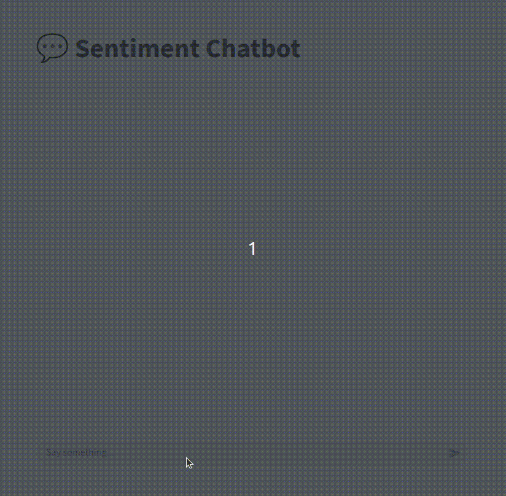

# Sentiment Chatbot App

## Install

### Python dependances

```shell
pip install -r requirements.txt
```

### Import Model

```shell
python -c "import nltk; nltk.download('vader_lexicon')"
```

## Usage

### Api

```shell
uvicorn api:app --port 9000
```

### Web

```shell
streamlit run app.py --server.port 8000
```



Web App Usage 
